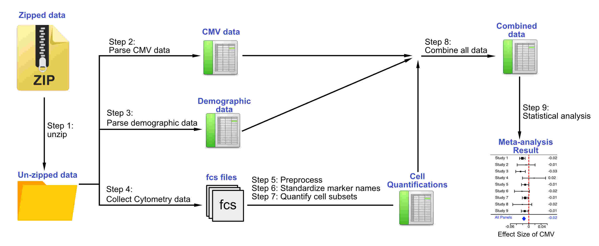

## Load packages
Before we start the workflow, let's install all the packages we will use. dplyr is a popular package for data wrangling. MetaCyto^5^ is a package for the automated meta-analysis of cytometry data. knitr is a package used to create HTML output from R Markdown files. 
```{r, echo = TRUE,results='asis',message=FALSE,warning=FALSE,cache=FALSE}
# install dplyr and knitr from CRAN if it isn not already installed
if(!require(dplyr)){install.packages("dplyr",repos = "http://cran.us.r-project.org")}
if(!require(knitr)) install.packages(c("knitr"),repos = "http://cran.us.r-project.org")

# install Metacyto from Bioconductor if it is not already installed
if(!require(MetaCyto)){
  source("https://bioconductor.org/biocLite.R")
  biocLite("MetaCyto")
}

# load the packaages
library(dplyr)
library(MetaCyto)
library(knitr)
opts_chunk$set(echo = TRUE)
dir.create("Result")
```

## Introduction
CMV is a β-herpesvirus that infects 40 – 100 % of population worldwide in a latent form. It not only can cause substantial morbidity and mortality in immune-compromised patients, but also alters the immune response in healthy individuals. In this tutorial, we will perform a meta-analysis to reveal the effect of latent cytomegalovirus (CMV) on the circulating immune cells. The meta-analysis will use data from three studies publicly available in the ImmPort database^1^ ( [SDY113](http://www.immport.org/immport-open/public/study/study/displayStudyDetail/SDY113), [SDY311](http://www.immport.org/immport-open/public/study/study/displayStudyDetail/SDY311) and [SDY515](http://www.immport.org/immport-open/public/study/study/displayStudyDetail/SDY515))^2-4^. This tutorial is designed to help you gain hands-on experience in the following areas:

1. R programming
2. Data wrangling with ImmPort data
3. Automated cell gating of CyTOF data
4. Meta-analysis

## Overview of the meta-analysis
In this tutorial, we will identify the effect of CMV infection on circulating immune cells while controlling for the effect of other factors such as age and gender. To achieve our goal, we need three types of information for each subject: CMV status, demographic data and the quantification of cells in the peripheral blood.  We will parse the required information from ImmPort data, aggregate them together and perform statistical analysis to reveal the effect of CMV infection. The whole workflow can be divided into 9 steps (shown in Figure 1). In the following sections, we will walk you through the analysis workflow. 

```{r,echo=FALSE,results='asis',message=FALSE,warning=FALSE}

cat("**\n Figure 1: The workflow of the meta-analysis to reveal the impact of CMV on immune cells.**")
```

## Step 1: Load packages and Unzip data
For simplicity of the tutorial, we have downloaded the three studies from ImmPort. Some of the data are in the compressed form (zip files). Lets un-zip the file first before we start the downstream steps. 

```{r, echo=TRUE,results='asis',message=FALSE,warning=FALSE,cache=FALSE}
# unzip data from SDY113
zip_file = list.files("Data/SDY113",pattern = "DR26_Tab.zip",
                      full.names = T,recursive = T)
unzip(zip_file,exdir ="Data/SDY113" )

# unzip data from SDY311
zip_file = list.files("Data/SDY311",pattern = "DR26_Tab.zip",
                      full.names = T,recursive = T)
unzip(zip_file,exdir ="Data/SDY311" )

# unzip data from SDY515
zip_file = list.files("Data/SDY515",pattern = "DR26_Tab.zip",
                      full.names = T,recursive = T)
unzip(zip_file,exdir ="Data/SDY515" )
```

## Step 2: Parse CMV data 
Each study has measured the CMV antibody titer in subjects. We can know if a person is infected by CMV based on the presence or absence of the CMV antibody. In this step, we first find the CMV antibody titer in the table "lab_test.txt". We then group samples into CMV positive and negative groups based on the antibody titer. Finally, we map the CMV information from samples to subjects using information in the table "biosample.txt". 
```{r, echo=TRUE,results='asis',message=FALSE,warning=FALSE,cache=FALSE}
# read CMV data from three studies
fn = list.files("Data",pattern = "lab_test.txt", full.names = T, recursive =  T)
lab_test = lapply(fn, function(x){read.table(file = x, header = T, sep = "\t")})
lab_test = Reduce(rbind,lab_test)

# identify CMV+ and CMV- biosamples
lab_test = subset(lab_test,lab_test$NAME_REPORTED=="CMV Ab")
lab_test = mutate(lab_test,"CMV_Positive"=(RESULT_VALUE_PREFERRED>0))
lab_test = mutate(lab_test,"CMV_Ab"=RESULT_VALUE_PREFERRED)

# Map biosample to subjects
fn = list.files("Data",pattern = "^biosample.txt", full.names = T, recursive =  T)
biosample = lapply(fn, function(x){read.table(file = x, header = T, sep = "\t")})
biosample = Reduce(rbind,biosample)
lab_test = inner_join(biosample[,c("BIOSAMPLE_ACCESSION","SUBJECT_ACCESSION")],
                      lab_test[,c("BIOSAMPLE_ACCESSION","CMV_Positive","CMV_Ab")],
                      by = "BIOSAMPLE_ACCESSION")
kable(lab_test[1:5,])
```

## Step 3: Collect subject information
Age and gender can affect the composition of immune cells. For example, the number of naive T cells decrease with age. To control for the effect of age and gender, we first need to find the demographic data from each study. The information are contained in the "Subject_2_CyTOF_result.txt" files in each study. We use the function "sampleInfoParser" from the MetaCyto package^5^ to parse the information. 

```{r, echo=TRUE,results='asis',message=FALSE,warning=FALSE,cache=FALSE}
# read data
meta_data_SDY113=read.table("Data/SDY113/SDY113-DR26_Subject_2_CyTOF_result.txt",sep='\t',header=T)
meta_data_SDY311=read.table("Data/SDY311/SDY311-DR26_Subject_2_CyTOF_result.txt",sep='\t',header=T)
meta_data_SDY515=read.table("Data/SDY515/SDY515-DR26_Subject_2_CyTOF_result.txt",sep='\t',header=T)

# parse demographic information in SDY113
sample_info_SDY113=sampleInfoParser(metaData=meta_data_SDY113,
                                    studyFolder="Data/SDY113",
                                    assay="CyTOF",
                                    fcsCol="File.Name",
                                    attrCol=c("Subject.Age","Gender","Subject.Accession"))

# parse demographic information in SDY311
sample_info_SDY311=sampleInfoParser(metaData=meta_data_SDY311,
                                    studyFolder="Data/SDY311",
                                    assay="CyTOF",
                                    fcsCol="File.Name",
                                    attrCol=c("Subject.Age","Gender","Subject.Accession"))

# parse demographic information in SDY515
sample_info_SDY515=sampleInfoParser(metaData=meta_data_SDY515,
                                    studyFolder="Data/SDY515",
                                    assay="CyTOF",
                                    fcsCol="File.Name",
                                    attrCol=c("Subject.Age","Gender","Subject.Accession"))
# combine data
sample_info=rbind(sample_info_SDY113,sample_info_SDY311,sample_info_SDY515)
# Look at the results
kable(sample_info[1:5,])
```

## Step 4: Organize cytometry data
Each study has profiled the circulating immune cells using mass cytometry (CyTOF). The data are stored in fcs files. Because the fcs files may contain different markers (or fluorescent/isotope labels), it is important to group fcs file with the same marker panel together. We use the function "fcsInfoParser" from MetaCyto^5^ package to achieve this. 

```{r, echo=TRUE,results='asis',message=FALSE,warning=FALSE,cache=FALSE, results=FALSE}
# Organize cytometry data from SDY113
fcs_info_SDY113=fcsInfoParser(metaData=meta_data_SDY113,
                              studyFolder="Data/SDY113",
                              fcsCol="File.Name",
                              assay="CyTOF")

# Organize cytometry data from SDY311
fcs_info_SDY311=fcsInfoParser(metaData=meta_data_SDY311,
                              studyFolder="Data/SDY311",
                              fcsCol="File.Name",
                              assay="CyTOF")

# Organize cytometry data from SDY515
fcs_info_SDY515=fcsInfoParser(metaData=meta_data_SDY515,
                              studyFolder="Data/SDY515",
                              fcsCol="File.Name",
                              assay="CyTOF")
# combine data from three studies
fcs_info=rbind(fcs_info_SDY113,fcs_info_SDY311,fcs_info_SDY515)
```
```{r, echo=TRUE,results='asis',message=FALSE,warning=FALSE,cache=FALSE}
# Look at the results
kable(fcs_info[1:5,])
```

## Step 5: Preprocess fcs files using MetaCyto

In this step, we preprocess the fcs files using the ["preprocessing.batch"](https://www.bioconductor.org/packages/devel/bioc/manuals/MetaCyto/man/MetaCyto.pdf) function in the MetaCyto package. The preprocessing process generally includes: data transformation and signal compensation. Since we are using CyTOF data in this tutorial, the compensation step is skipped here. The preprocessed data will be written to the folder "Result/preprocess_output". 

```{r, echo=TRUE,results='asis',message=FALSE,warning=FALSE,cache=FALSE,results=FALSE}
preprocessing.batch(inputMeta=fcs_info,
                    assay="CyTOF",
                    b=1/5,
                    outpath="Result/preprocess_output",
                    excludeTransformParameters=c("Time","Cell_length"))
```

## Step 6: Standardize Marker Names
fcs files from different studies may use different names even for the same cell marker. For example, CCR7 is named "CCR7(GD160)DD" in SDY311. To combine data between datasets, we need to standardize the marker names. 

The ["nameUpdator"](https://www.bioconductor.org/packages/devel/bioc/manuals/MetaCyto/man/MetaCyto.pdf) function in MetaCyto allow user to change the marker names in one step. The function requires three arguments: oldNames, newNames and files, which specifies the original marker names in the fcs files, the new standardized marker names and the summary files from the preprocess.batch function. We can extract the original marker names from the output of the panelSummary function. We then define the newNames by deleting the letters after the parentheses using the "gsub" function. For example, "CCR7(GD160)DD" will be standardized to "CCR7".


```{r, echo=TRUE,results='asis',message=FALSE,warning=FALSE,cache=FALSE,results=FALSE}
# look at marker names
files=list.files("Result",pattern="processed_sample",recursive=T,full.names=T)
panel_info=collectData(files,longform=F)
#jpeg("Result/panel_summary_1.jpeg",width = 3000,height = 1500)
#PS=panelSummary(panel_info,cluster=F)
#dev.off()
dir.create("Result/old_panel")
PS=panelSummary(panel_info,cluster=F,folder = "Result/old_panel",width = 40, height = 20)

# change marker name
old_names=sort(rownames(PS))
new_names = gsub("\\(.*","",old_names)
nameUpdator(oldNames=old_names,newNames=new_names,files)

# check marker name again after the standardization
panel_info=collectData(files,longform=F)
#jpeg("Result/panel_summary_2.jpeg",width = 3000,height = 1500)
#PS=panelSummary(panel_info,cluster=F)
#dev.off()
dir.create("Result/new_panel")
PS=panelSummary(panel_info,cluster=F,folder = "Result/new_panel",width = 40, height = 20)

```

```{r, echo=TRUE,results='asis',message=FALSE,warning=FALSE,cache=FALSE,out.width = "900px",out.height="400px"}
# look at panels before standardization
include_graphics("Result/old_panel/panel_summary.pdf")
# look at panels after standardization
include_graphics("Result/new_panel/panel_summary.pdf")
```

## Step 7: Quantify cell subsets using MetaCyto
In this step, we quantify the statistics including proportion in blood and MFI of markers, for 24 cell types: B cells, CD16- monocytes, CD16+ monocytes, CD4+ T cells, CD8+ T cells, central memory CD4+ T cells, central memory CD8+ T cells, effector CD4+ T cells, effector CD8+ T cells, effector memory CD4+ T cells, effector memory CD8+ T cells, gamma-delta T cells, memory B cells, monocytes, naive B cells, naive CD4+ T cells, naive CD8+ T cells, NK cells, NKT cells, plasmablasts, T cells, transitional B cells, Tregs and dendritic cells. 

We will use the [searchCluster.batch](https://www.bioconductor.org/packages/devel/bioc/manuals/MetaCyto/man/MetaCyto.pdf) function in the MetaCyto package for the quantification. The function runs a collection of algorithms to identify the cell subsets according to the specified definitions. See the [MetaCyto manuscript](https://www.biorxiv.org/content/early/2017/06/09/130948) for more details. The definition of each cell type are stored in the table "Data/cell_definition.csv". The output will be written to the folder "Result/search_output".
```{r, echo=TRUE,results='asis',message=FALSE,warning=FALSE,cache=FALSE}
cell_definitions = read.csv("Data/cell_definition.csv")
# look at the cell definitions
kable(cell_definitions[1:5,])
```

```{r, echo=TRUE,results='asis',message=FALSE,warning=FALSE,cache=FALSE,results=FALSE}
searchCluster.batch(preprocessOutputFolder="Result/preprocess_output",
                    outpath="Result/search_output",
                    clusterLabel=cell_definitions$label,
                    ifPlot = F)
```

## Step 8: combine data
In this step, we combine the CMV data, demographic data and the cell quantification data together into one table. 
```{r, echo=TRUE,results='asis',message=FALSE,warning=FALSE,cache=FALSE,results=TRUE}
# combine CMV data with demographic data
sample_info = left_join(sample_info,lab_test[,c("SUBJECT_ACCESSION","CMV_Positive")],
                        by = c("Subject.Accession"="SUBJECT_ACCESSION"))
files=list.files("Result/search_output",pattern="cluster_stats_in_each_sample",recursive=T,full.names=T)

# Then combine with cell quantification data 
fcs_stats=collectData(files,longform=T)
all_data=inner_join(fcs_stats,sample_info,by="fcs_files")
all_data = na.omit(all_data)
all_data = subset(all_data,all_data$parameter_name=="fraction")
all_data = inner_join(all_data,cell_definitions,by="label")

# look at the combined data
kable(all_data[1:10,c("study_id","parameter_name","value","label",
                "Subject.Age", "Gender","Subject.Accession", "CMV_Positive")])
```

## Step 9: statistical analysis
In this step, we perform meta-analysis to estimate the impact of CMV on immune cells using the "glmAnalysis" and "metaAnalysis" functions from MetaCyto. At the back-end of "glmAnalysis" function, a regression (cell percent =  b1 x CMV status + b2 x Gender + b3 x Age + b4 x Study ID) is run. The effect size of CMV on the cell percentage is defined as b1/SD(cell percent). The "glmAnalysis" function provides a comprehensive view of how CMV affects different cell subsets. At the backed of "metaAnalysis", the effect size of CMV is estimated separately in each study using a regression (cell percent =  b1 x CMV status + b2 x Gender + b3 x Age). The effect sizes are then combined together using a random effect model. 

```{r, echo=TRUE,results='asis',message=FALSE,warning=FALSE,cache=FALSE,results=TRUE}
# See the fraction of what clusters are affected by age (while controlling for GENDER)
GA=glmAnalysis(value="value",variableOfInterst="CMV_Positive",parameter="fraction",
               otherVariables=c("Gender","Subject.Age"),studyID="study_id",label="Name",
               data=all_data,CILevel=0.95,ifScale=c(T,F))
GA=GA[order(GA$Effect_size),]

# plot the results
plotGA(GA)

# Let's take a closer look at the NKT cells (CD14-|CD33-|CD3+|CD56+).
L="NKT cells"
dat=subset(all_data,all_data$parameter_name=="fraction"&all_data$Name==L)
MA=metaAnalysis(value="value",variableOfInterst="CMV_Positive",main=L,
                otherVariables=c("Gender","Subject.Age"),studyID="study_id",
                data=dat,CILevel=0.95,ifScale=c(T,F))

# Let's take a closer look at the plasma cells (CD14-|CD33-|CD3-|CD20-|CD27+|CD38+).
L="plasmablasts"
dat=subset(all_data,all_data$parameter_name=="fraction"&all_data$Name==L)
MA=metaAnalysis(value="value",variableOfInterst="CMV_Positive",main=L,
                otherVariables=c("Gender","Subject.Age"),studyID="study_id",
                data=dat,CILevel=0.95,ifScale=c(T,F))

```

## References
[1] Bhattacharya, Sanchita, et al. "ImmPort, toward repurposing of open access immunological assay data for translational and clinical research." Scientific data 5 (2018): 180015.

[2] Sasaki, Sanae, et al. "Distinct cross-reactive B-cell responses to live attenuated and inactivated influenza vaccines." The Journal of infectious diseases 210.6 (2014): 865-874.

[3] Blazkova, Jana, et al. "Multicenter systems analysis of human blood reveals immature neutrophils in males and during pregnancy." The Journal of Immunology 198.6 (2017): 2479-2488.

[4] Brodin, Petter, et al. "Variation in the human immune system is largely driven by non-heritable influences." Cell 160.1-2 (2015): 37-47.

[5] Hu, Zicheng, et al. "Meta-analysis of Cytometry Data Reveals Racial Differences in Immune Cells." bioRxiv (2017): 130948.


